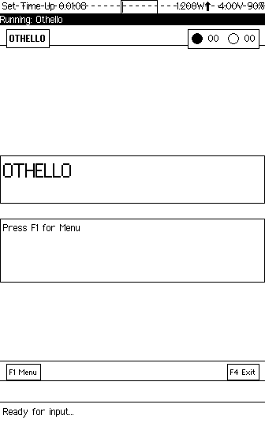
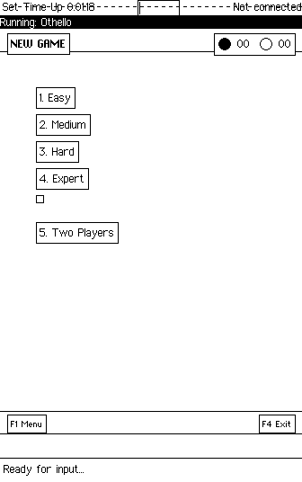
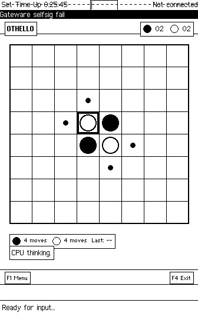
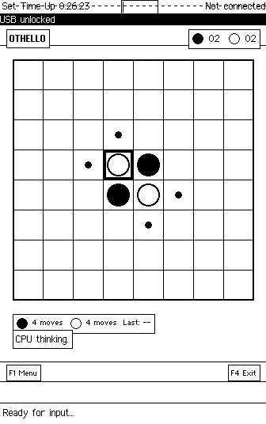
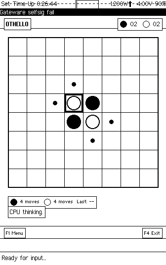

# Precursor Othello

**Adversarial thinking on sovereign hardware.**

```
"In Othello, every move is a statement about the future.
You place a disc. It flips everything between itself and its allies.
But your opponent's next move can flip them back.
The board is a landscape of reversible commitments —
nothing is permanent until the game is over."
```

---

## What This Is

Precursor Othello is a tournament-quality Othello (Reversi) game for the [Precursor](https://precursor.dev) handheld -- bunnie Huang's open-source, auditable secure computing device. It features an AI opponent with four difficulty levels, two-player pass-and-play, a "What If" analysis mode for exploring alternate lines of play, and persistent encrypted statistics across all your games.

The AI uses minimax search with alpha-beta pruning -- the same family of algorithms that powered Deep Blue's 1997 victory over Kasparov. At Expert level, it searches 8 plies deep with an opening book and endgame solver. But unlike Deep Blue, this opponent runs on hardware you can physically inspect, on an operating system built from verifiable source, executing on an FPGA whose bitstream you can audit. The adversary is transparent. The challenge is real.

---

## Why This Project

Board games are the oldest form of adversarial thinking. Before game theory had a name, before von Neumann formalized minimax, before Shannon wrote his chess programming paper -- people sat across from each other and competed through structured rules on bounded surfaces. The board is an arena. The rules are a contract. The opponent is a mirror.

Othello is elegant because it is simple to learn and genuinely deep to master. The rules fit in a paragraph: place a disc, flip what you outflank, most discs wins. But the strategy is treacherous. A position that looks dominant can collapse in a single move. Corners are permanent. Edges are valuable. The center is contested. Mobility matters more than disc count until the endgame, at which point disc count is all that matters. Every principle has a phase where it reverses.

This reversal mechanic -- the fact that every piece on the board can change ownership at any moment -- makes Othello a uniquely honest game about the nature of advantage. Nothing is yours until the board is full.

Running a competitive AI on a 100 MHz CPU is a genuine engineering challenge. Desktop Othello programs search millions of positions per second on multi-gigahertz processors. Precursor's VexRISC-V core runs at 100 MHz with no floating point, no SIMD, no out-of-order execution. Every evaluation function call, every alpha-beta cutoff, every hash table lookup matters. The constraint is not academic -- it is the difference between an Expert AI that responds in 2 seconds and one that takes 20.

---

## Why Precursor

Othello's board is 64 squares. A bitboard representation stores one player's pieces as a single `u64` -- one bit per square. The entire board state fits in two `u64` values: 128 bits total. Move generation becomes bitwise AND, OR, and shift operations. Flipping discs becomes a mask operation. On a RISC-V CPU with native 32-bit registers, these 64-bit operations decompose into pairs of 32-bit instructions -- efficient, predictable, and cache-friendly on hardware with no cache.

The 100 MHz CPU constrains search depth in a way that makes difficulty levels *meaningful*. On a modern desktop, the difference between 4-ply and 8-ply search is imperceptible to the user -- both respond instantly. On Precursor, 4-ply (Medium) responds in under a second while 8-ply (Expert) takes 1-3 seconds of visible thinking time. You can feel the AI working harder. The constraint became the feature.

The physical keyboard provides tactile move placement. Arrow keys move the cursor across the board. Enter places a disc. There is no touchscreen ambiguity, no tap-versus-drag confusion. The input is as discrete as the game's logic: you move to a square, you commit to it.

The game engine lives in a separate `othello-core` library with zero Xous dependencies. It compiles and runs on any Rust target, enabling host-side testing with 40+ unit tests covering board operations, move generation, game state transitions, and AI correctness. The platform-specific app is a thin shell around a platform-independent engine.

---

## How It Works

### AI Opponent with Four Difficulty Levels

| Level | Search Depth | Features |
|-------|--------------|----------|
| **Easy** | 2-ply | Disc count evaluation only |
| **Medium** | 4-ply | Positional awareness (corners, edges) |
| **Hard** | 6-ply | Full evaluation + endgame solver (12 empties) |
| **Expert** | 8-ply | Opening book + endgame solver (14 empties) |

The AI evaluates positions based on corner control, mobility, stability, and frontier disc count. The endgame solver switches to exact disc-count search when few empty squares remain, playing perfectly through the final moves.

### Two-Player Mode

Pass the device between players for head-to-head games. The game tracks whose turn it is and enforces all standard Othello rules including mandatory pass when no legal moves exist.

### Game Analysis -- "What If" Mode

After any game, review the entire move history and explore alternate lines of play:

- Step through any game position with Left/Right arrows
- Branch from any point by making an alternate move
- Continue playing out "what if" scenarios
- See how different choices would have changed the outcome

### Visual Feedback

- Valid move indicators (small dots on legal squares)
- Last move highlighting (corner markers)
- Cursor-based navigation with thick border highlight
- Optional coordinate display (A-H, 1-8)
- Hint system showing the AI's recommended move

### Persistent Encrypted Storage

All data is stored encrypted in the PDDB (Plausibly Deniable DataBase):

- **Settings**: Coordinate display, valid move indicators, undo, vibration
- **Statistics**: Win/loss/draw records for each difficulty level
- **Save Game**: Resume interrupted games exactly where you left off

### Random Color Assignment

In vs CPU mode, your color (Black or White) is randomly assigned each game using hardware TRNG, ensuring fair variety. No psychological advantage from always playing first.

---

## Controls

### Universal Keys

| Key | Action |
|-----|--------|
| **F1** | Open context menu |
| **F4** | Exit / Back |
| **Q** | Quit (at main menu) |

### During Game

| Key | Action |
|-----|--------|
| **Arrow Keys** | Move cursor |
| **Enter** | Place disc |
| **F2** | Show hint (AI's best move) |
| **U** | Undo last move (if enabled) |

### Game Over

| Key | Action |
|-----|--------|
| **Enter** | New game (same mode) |
| **W** | Enter What If mode |
| **N** | Select new game mode |

### What If Mode

| Key | Action |
|-----|--------|
| **Left/Right** | Step through history |
| **Arrow Keys** | Move cursor (when branching) |
| **Enter** | Play alternate move |

---

## Rules

Othello is played on an 8x8 board. Black moves first. Players take turns placing discs of their color. When you place a disc, any opponent discs that are "outflanked" -- in a straight line between your new disc and another of your discs, in any of eight directions -- are flipped to your color.

You must make a move that flips at least one disc. If you cannot, your turn passes. The game ends when neither player can move (usually when the board is full). The player with the most discs wins.

---

## Technical Architecture

```
precursor-othello/
├── Cargo.toml              # Main app manifest
├── src/
│   ├── main.rs             # Entry point, event loop
│   ├── app.rs              # State machine, game logic
│   ├── ui.rs               # Drawing functions
│   ├── menu.rs             # F1 context menu system
│   ├── help.rs             # Context-sensitive help screens
│   ├── storage.rs          # PDDB persistence
│   ├── review.rs           # What If mode logic
│   ├── feedback.rs         # Vibration, TRNG
│   └── export.rs           # TCP game export
│
└── libs/othello-core/      # Platform-independent game engine
    ├── Cargo.toml
    └── src/
        ├── lib.rs          # Public API
        ├── board.rs        # Bitboard representation (two u64)
        ├── moves.rs        # Move generation, flip calculation
        ├── game.rs         # GameState with full history
        ├── ai.rs           # Minimax + alpha-beta pruning
        ├── eval.rs         # Position evaluation function
        └── opening.rs      # Opening book for Expert mode
```

### Bitboard Representation

The board uses two 64-bit integers -- one for black pieces, one for white. Bit 0 is square A1, bit 63 is H8. This encoding enables move generation and flip calculation through pure bit manipulation:

- **Legal moves**: Shift opponent bits in each direction, AND with player bits, accumulate reachable empty squares
- **Flip calculation**: For a placed disc, trace outward in all 8 directions until hitting a friendly disc, then flip the mask
- **Mobility count**: `popcount` on the legal move bitboard

On RV32, each 64-bit operation decomposes into two 32-bit instructions. No special hardware required.

### Minimax with Alpha-Beta Pruning

The AI searches the game tree to a fixed depth, alternating between maximizing (AI's turn) and minimizing (opponent's turn) the evaluation score. Alpha-beta pruning eliminates branches that cannot affect the final decision, typically reducing the effective branching factor from ~10 to ~6.

The evaluation function considers:
- **Corner control**: Corners can never be flipped; they anchor stable regions
- **Mobility**: Number of legal moves available (more options = more flexibility)
- **Stability**: Discs that can never be flipped (edges anchored by corners)
- **Frontier discs**: Discs adjacent to empty squares (vulnerable to being outflanked)

At Expert level, the AI also consults an opening book for the first several moves and switches to exact endgame solving when 14 or fewer empty squares remain.

### State Machine

The app uses a clean `AppState` enum for predictable UI flow:

```
MainMenu -> NewGameMenu -> Playing -> GameOver -> (WhatIf | NewGameMenu)
         -> Settings
         -> Statistics
         -> Help
```

Focus changes from the Xous GAM cleanly pause and resume the current state.

### PDDB Storage Layout

| Dictionary | Key | Contents |
|------------|-----|----------|
| `othello.settings` | `config` | 10-byte settings blob |
| `othello.stats` | `stats` | 26-byte statistics (13 x u16) |
| `othello.save` | `current` | Serialized game state with history |

---

## Design Decisions

1. **Bitboard Representation**: Two `u64` integers encode the entire board state, enabling efficient move generation and flip calculation using bit manipulation. The representation is standard in competitive Othello programming.

2. **Separate Game Engine**: `othello-core` has no Xous dependencies and compiles on any Rust target. This enables host-side development, testing, and benchmarking without needing Renode or hardware.

3. **State Machine Architecture**: The app uses a clean state machine (`AppState` enum) for predictable UI flow between menus, gameplay, and review modes. Each state handles its own input and rendering.

4. **F1/F4 Keyboard Standard**: Follows the Precursor app conventions -- F1 opens context menus, F4 exits or goes back. Consistent with the platform's interaction language.

5. **Random Color Assignment**: Uses hardware TRNG for true randomness when assigning player color vs CPU. No bias, no pattern, no predictability.

---

## Testing

The game engine includes 40+ unit tests covering board operations, move generation, game state transitions, and AI correctness:

```bash
cd libs/othello-core
cargo test
```

Tests run on the host system (macOS, Linux, Windows) -- no emulator or hardware required.

---

## Building

Precursor Othello is a Xous app. It builds as part of the [xous-core](https://github.com/betrusted-io/xous-core) workspace.

### Integration

1. Clone into your xous-core apps directory:

   ```bash
   cd xous-core/apps
   git clone https://github.com/tbcolby/precursor-othello.git othello
   ```

2. Add to workspace `Cargo.toml` (both `members` and `default-members`):

   ```toml
   [workspace]
   members = [
       # ... existing apps ...
       "apps/othello",
       "libs/othello-core",
   ]
   ```

3. Add to `apps/manifest.json`:

   ```json
   {
     "othello": {
       "context_name": "Othello",
       "menu_name": {
         "appmenu.othello": {
           "en": "Othello",
           "en-tts": "Othello"
         }
       }
     }
   }
   ```

4. Build and run:

   ```bash
   # For Renode emulator
   cargo xtask renode-image othello

   # For real hardware
   cargo xtask app-image othello
   ```

### Technical Details

- **Display**: 336x536 pixels, 1-bit (black/white only)
- **Board Size**: 304x304 pixels (38px cells) or 272x272 with coordinates (34px cells)
- **Disc Rendering**: Filled circles using GAM `draw_circle`
- **AI Performance**: Expert mode typically responds in 1-3 seconds on 100MHz CPU

---

## Screenshots

*Captured via headless Renode emulation on macOS ARM64. The Precursor display is 336x536 pixels, 1-bit monochrome.*

### The Opening -- Choose Your Opponent

The title screen. Othello waits for you to press F1 and choose your challenge. The header bar tracks score -- right now, everything is zero. The board is empty. The game hasn't begun.



### Five Ways to Play

Easy through Expert pit you against increasingly sophisticated AI. Two Players lets you pass the device for head-to-head games. The difficulty levels are not cosmetic -- each one doubles the search depth, and on a 100 MHz CPU, you can feel the difference.



### Opening Position -- Four Pieces, Infinite Possibilities

The standard Othello opening: two black, two white, arranged diagonally in the center. Small dots mark legal moves. From here, the game tree branches into roughly 10^58 possible positions. The AI is already thinking.


### Two Players -- Pass the Device

No network required. Two humans, one board, one device. The game enforces all rules and tracks whose turn it is. The physical keyboard means each player gets the same tactile experience.


### Mid-Game -- Territory Takes Shape

The board fills. Discs cluster along edges and fight for corners. The status bar shows move counts and the last move played. Every placement changes the strategic landscape for both players.


### Settings -- Customize Your Game

Toggle coordinate display, valid move indicators, undo capability, and haptic feedback. Preferences persist in encrypted PDDB storage across sessions.



### Your Record -- Statistics Across All Difficulties

Wins, losses, and draws tracked separately for each AI level and two-player mode. A permanent record of your adversarial education, stored in hardware-encrypted flash.



### Context Help

Context-sensitive help explains controls for the current screen. The game teaches itself.



---

## Changelog

### v0.2.0

- **Fixed F4 exit** -- F4 at main menu now properly quits the app
- **Added 'q' quit shortcut** -- Press 'q' at main menu to exit

### v0.1.0

- Initial release with AI opponent, What If mode, and persistent storage

---

## Related Projects

- [carse-automata](https://github.com/tbcolby/carse-automata) -- Cellular automaton sandbox for Precursor
- [precursor-writer](https://github.com/tbcolby/precursor-writer) -- Markdown editor for Precursor
- [precursor-flashcards](https://github.com/tbcolby/precursor-flashcards) -- Spaced repetition flashcards
- [precursor-timers](https://github.com/tbcolby/precursor-timers) -- Multiple concurrent timers
- [xous-dev-toolkit](https://github.com/tbcolby/xous-dev-toolkit) -- Development tools and agent system

## Development
---
This app was developed using the methodology described in [xous-dev-toolkit](https://github.com/tbcolby/xous-dev-toolkit) -- an LLM-assisted approach to Precursor app development on macOS ARM64.

## Author
---
Made by Tyler Colby -- [Colby's Data Movers, LLC](https://colbysdatamovers.com)

Contact: [tyler@colbysdatamovers.com](mailto:tyler@colbysdatamovers.com) | [GitHub Issues](https://github.com/tbcolby/precursor-othello/issues)

## License
---
Licensed under the Apache License, Version 2.0.

See [LICENSE](LICENSE) for the full text.
